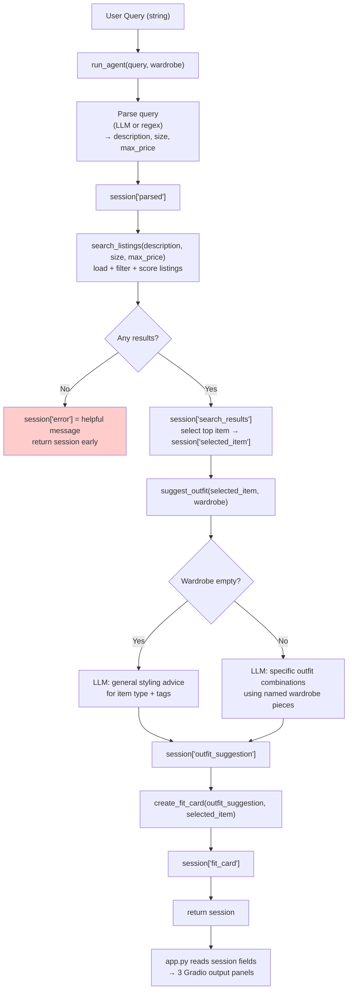

# FitFindr — planning.md

> Complete this document before writing any implementation code.
> Your spec and agent diagram are what you'll use to direct AI tools (Claude, Copilot, etc.) to generate your implementation — the more specific they are, the more useful the generated code will be.
> Your planning.md will be reviewed as part of your submission.
> Update it before starting any stretch features.

---

## Tools

List every tool your agent will use. For each tool, fill in all four fields.
You must have at least 3 tools. The three required tools are listed — add any additional tools below them.

### Tool 1: search_listings

**What it does:**
<!-- Describe what this tool does in 1–2 sentences -->
     searches the mock listings dataset for matching items. Needs to be able to handle no matches found case.

**Input parameters:**
<!-- List each parameter, its type, and what it represents -->
- `description` (str): A description of the item being searched for
- `size` (str): the size of the item being searched for
- `max_price` (float): the maximum price acceptable for the item being searched for. If none is given then allow items of any price.

**What it returns:**
<!-- Describe the return value — what fields does a result contain? -->
     return the entire listing block for each item that matches the search
**What happens if it fails or returns nothing:**
<!-- What should the agent do if no listings match? -->
     return a -1 in case of failure to be handled by the AI.
---

### Tool 2: suggest_outfit

**What it does:**
<!-- Describe what this tool does in 1–2 sentences -->
     Take an item and current wardrobe, suggest outfit combinations. Must be able to handle empty or minimal wardrobes
**Input parameters:**
<!-- List each parameter, its type, and what it represents -->
- `new_item` (dict): the item that needs to be used in the outfit
- `wardrobe` (dict): the users wardrobe

**What it returns:**
<!-- Describe the return value -->
     return an array with at least one outfit combination.
**What happens if it fails or returns nothing:**
<!-- What should the agent do if the wardrobe is empty or no outfit can be suggested? -->
     if no suggested outfit return "no outfit can be suggested". if empty wardrobe return -1
---

### Tool 3: create_fit_card

**What it does:**
Generates a short, shareable 2–4 sentence outfit caption in the style of an Instagram/TikTok OOTD post for the thrifted find. Uses higher LLM temperature to produce varied output for different inputs.

**Input parameters:**
- `outfit` (str): the outfit suggestion string returned by `suggest_outfit()`
- `new_item` (dict): the listing dict for the thrifted item (fields: id, title, description, category, style_tags, size, condition, price, colors, brand, platform)

**What it returns:**
A 2–4 sentence string that reads like a real OOTD caption — casual and authentic, mentions the item name, price, and platform naturally (once each), and captures the outfit vibe in specific terms.

**What happens if it fails or returns nothing:**
If `outfit` is empty or whitespace-only, return a descriptive error string such as `"Could not generate fit card: outfit suggestion was empty."` — do NOT raise an exception.

---

### Additional Tools (if any)

<!-- Copy the block above for any tools beyond the required three -->

---

## Planning Loop

**How does your agent decide which tool to call next?**
<!-- Describe the logic your planning loop uses. What does it look at? What conditions change its behavior? How does it know when it's done? -->
Take the user input(str) and a gradio conversation history(list) as inputs. Output a string that is the agents response for the iteration. There should always be an agent response after each iteration. Each LLM call will include the history (after appending the current user input) and definitions for each of the available tools, and tool_choice="auto" so the LLM can decide whether to call tools. The agent will use this information to determine which tool to call. The LLM response should include the str as well as an attribute containing which tool to call or 0 if no tool should be called.

After receiving the response from the LLM, the requested tools shall be called and have their results appended to the conversation history. 

The loop shall stop when a response with no tool calls is returned, denoted by a 0 in the tool_calls attribute. The loop shall also stop if a limit of 5 tool calls has been reached. If the limit is reached the user shall be notified.

After termination, the final response from the LLM shall be displayed to the user.
---

## State Management

**How does information from one tool get passed to the next?**
All state is stored in a single `session` dict initialized by `_new_session(query, wardrobe)` at the start of each `run_agent()` call. Each step writes its output into a dedicated key so subsequent steps can read it:

| Key | Set by | Read by |
|-----|--------|---------|
| `session["query"]` | `_new_session` | query parsing step |
| `session["parsed"]` | query parser (LLM or regex) | `search_listings` call |
| `session["search_results"]` | `search_listings` | item selection step |
| `session["selected_item"]` | item selection step | `suggest_outfit`, `create_fit_card` |
| `session["wardrobe"]` | `_new_session` | `suggest_outfit` |
| `session["outfit_suggestion"]` | `suggest_outfit` | `create_fit_card` |
| `session["fit_card"]` | `create_fit_card` | returned to `app.py` |
| `session["error"]` | any early-exit step | `app.py` (checked first) |

`app.py` reads `session["selected_item"]`, `session["outfit_suggestion"]`, and `session["fit_card"]` to populate the three Gradio output panels. If `session["error"]` is set, the error is shown in the first panel and the other two are left blank.

---

## Error Handling

For each tool, describe the specific failure mode you're handling and what the agent does in response.

| Tool | Failure mode | Agent response |
|------|-------------|----------------|
| search_listings | No results match the query | Set `session["error"]` to a user-friendly message (e.g., "No listings found — try a broader description or higher price limit.") and return the session immediately without calling `suggest_outfit`. |
| suggest_outfit | Wardrobe is empty | Call the LLM with a general-styling prompt (what kinds of pieces pair well, what vibe the item suits) instead of referencing specific wardrobe items. Return that text as the outfit suggestion string. |
| create_fit_card | Outfit input is missing or incomplete | Return the string `"Could not generate fit card: outfit suggestion was empty."` — never raise an exception or return an empty string. |

---

## Architecture

---

## AI Tool Plan

<!-- For each part of the implementation below, describe:
     - Which AI tool you plan to use (Claude, Copilot, ChatGPT, etc.)
     - What you'll give it as input (which sections of this planning.md, your agent diagram)
     - What you expect it to produce
     - How you'll verify the output matches your spec before moving on

     "I'll use AI to help me code" is not a plan.
     "I'll give Claude my Tool 1 spec (inputs, return value, failure mode) and ask it to implement
     search_listings() using load_listings() from the data loader — then test it against 3 queries
     before trusting it" is a plan. -->

**Milestone 3 — Individual tool implementations:**

- **Tool 1 (`search_listings`):** Give Claude the Tool 1 spec (inputs, scoring logic, return format, empty-list failure mode) plus the `load_listings()` signature from `utils/data_loader.py`. Ask it to implement keyword scoring by splitting the description into words and counting overlap with each listing's title, description, and `style_tags`. Verify with three queries: `"vintage graphic tee under $30"` (should return ≥2 results), `"90s track jacket size M"` (should return lst_004), and `"designer ballgown size XXS under $5"` (should return empty list).

- **Tool 2 (`suggest_outfit`):** Give Claude the Tool 2 spec, the `suggest_outfit` docstring, and the wardrobe schema from `data/wardrobe_schema.json`. Ask it to implement with separate LLM prompts for empty vs. non-empty wardrobes. Test with the example wardrobe (should name specific wardrobe pieces) and with the empty wardrobe (should return general styling advice, not an empty string or error).

- **Tool 3 (`create_fit_card`):** Give Claude the Tool 3 spec (caption requirements: casual tone, mention item name/price/platform once, high temperature). Ask it to guard against an empty `outfit` string first. Verify by calling it twice with different outfit suggestions for the same item and confirming the captions differ.

**Milestone 4 — Planning loop and state management:**

Give Claude the Planning Loop and State Management sections of this file plus the `_new_session()` dict definition and tool signatures from `tools.py`. Ask it to implement `run_agent()` following the 7-step TODO in `agent.py`, using an LLM call to parse the query into description/size/max_price. Verify by running the two test cases at the bottom of `agent.py` directly: the happy-path case should print a non-None `fit_card`, and the no-results case should print a non-None `error` and a None `fit_card`.

---

## A Complete Interaction (Step by Step)

Write out what a full user interaction looks like from start to finish — tool call by tool call. Use a specific example query.

**Example user query:** "I'm looking for a vintage graphic tee under $30. I mostly wear baggy jeans and chunky sneakers. What's out there and how would I style it?"

**Step 1:** The agent parses the query (via LLM or regex) and extracts:
- `description = "vintage graphic tee"`
- `size = None` (none specified)
- `max_price = 30.0`

These are stored in `session["parsed"]`. The agent then calls `search_listings("vintage graphic tee", size=None, max_price=30.0)`. The tool loads all 40 listings, drops any priced above $30, and scores the rest by keyword overlap with "vintage graphic tee". Top matches (all ≤ $30):
- lst_006 "Graphic Tee — 2003 Tour Bootleg Style" ($24) — highest score; tags include `graphic tee`, `vintage`, `streetwear`
- lst_002 "Y2K Baby Tee — Butterfly Print" ($18) — tags include `graphic tee`, `vintage`
- lst_033 "Vintage Band Tee — Faded Grey" ($19) — tags include `vintage`, `graphic tee`

Results stored in `session["search_results"]`; top item (lst_006) stored in `session["selected_item"]`.

**Step 2:** Agent calls `suggest_outfit(lst_006, example_wardrobe)`. The example wardrobe is non-empty (10 items including baggy dark-wash jeans, chunky white sneakers, black denim jacket, black combat boots). The LLM is given the item details and all wardrobe pieces and asked to suggest 1–2 complete outfits. It returns something like:

> "Outfit 1: Graphic Tee — 2003 Tour Bootleg Style tucked into Baggy straight-leg jeans (dark wash) with Chunky white sneakers and a Black crossbody bag — classic streetwear with a vintage edge. Outfit 2: Same tee layered under the Black cropped zip hoodie with Black combat boots for a grungier take."

Stored in `session["outfit_suggestion"]`.

**Step 3:** Agent calls `create_fit_card(session["outfit_suggestion"], lst_006)`. The LLM is given the item details and outfit suggestion and asked for a casual 2–4 sentence OOTD caption. It returns something like:

> "Snagged this 2003 bootleg-style tee off Depop for $24 and it's already on heavy rotation. Styling it with my baggy dark wash jeans and chunky white sneakers — that effortless vintage streetwear combo that takes zero effort. The worn-in cotton and boxy fit do all the work."

Stored in `session["fit_card"]`.

**Final output to user:**
- **Panel 1 — Top listing found:** `Graphic Tee — 2003 Tour Bootleg Style | $24 | Depop | Size: L | Condition: good — Slightly boxy fit. 100% cotton, soft and worn-in.`
- **Panel 2 — Outfit idea:** The two outfit combinations from Step 2.
- **Panel 3 — Your fit card:** The OOTD caption from Step 3.
